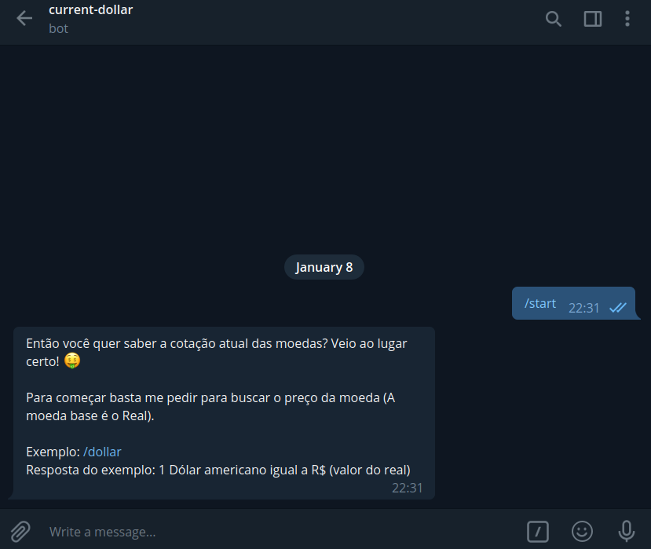

## Como criar um bot simples no telegram!

```
    1 - Primeiramente vá ao telegram e pesquise por BotFather.
    2 - Crie seu bot com o comando: /newbot e siga os passos para concluir a criação do seu bot.
    3 - Gere o .env da aplicação utilizando o comando: cp .env.example .env
    4 - Agora execute a aplicação: npm start
    5 - Acesse o telegram, pesquise pelo seu bot e utilize-o.
```




